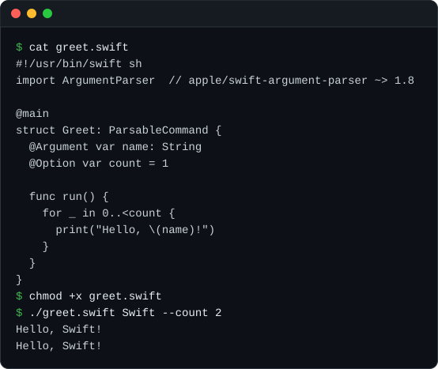

<p align="center">
  
</p>

<h1 align="center">swift-sh</h1>

<p align="center">
  Run single-file Swift scripts with SwiftPM dependencies declared next to their imports.
</p>

<p align="center">
  <a href="https://github.com/swift-library/swift-sh/actions/workflows/ci.yml"></a>
  
  
  <a href="LICENSE.txt"></a>
</p>

[Overview](#overview) · [Install](#install) · [Quick start](#quick-start) ·
[Usage](#usage) · [Requirements](#requirements) ·
[Documentation](#documentation) · [Contributing](#contributing) ·
[License](#license)

> [!NOTE]
> swift-sh is pre-1.0. Minor releases may include breaking changes to its
> commands and dependency comment syntax.

## Overview

swift-sh lets a single Swift file declare the packages it needs. Write a
comment after an `import` that names the repository and version, and
`swift sh` generates a SwiftPM package for the script, builds it in a cache,
and runs it with your arguments. The script stays one file with no
`Package.swift` to maintain. Swift runs the `swift-sh` executable on your
`PATH` as the `swift sh` subcommand.

- Dependency comments for GitHub repositories, Git URLs, and local packages,
  with `~>` and `==` version constraints. An import without a constraint
  selects the newest release as its lower bound and caches that selection.
- Imports read with SwiftParser, so comments and string literals never add
  dependencies. Compiler errors keep the script's own line numbers.
- Optimized builds, cached until the script, the contents of its local
  dependencies, or the Swift toolchain change. `--debug` builds a debug
  binary instead.
- Scripts from a file, standard input, or a named pipe, with arguments,
  standard streams, working directory, and exit status preserved.
- `swift sh package` to turn a script into a standalone SwiftPM package, and
  `swift sh open` to edit it in `$EDITOR` or Xcode.

## Install

Install with Homebrew from the swift-library tap:

```bash
brew install swift-library/tap/swift-sh
```

The formula builds swift-sh from its release source, so Swift 6.3 or later
must be on `PATH`. On macOS, select Xcode 26 or later with `xcode-select`.

To build from source instead:

```bash
git clone --branch v0.2.0 https://github.com/swift-library/swift-sh.git
cd swift-sh
swift build -c release --force-resolved-versions
```

Copy `.build/release/swift-sh` to a directory on your `PATH`, then check the
installation with `swift sh --version`.

## Quick start

Save this script as `greet.swift`. The comment after `import ArgumentParser`
tells swift-sh which package provides the module and which versions to
accept:

```swift
#!/usr/bin/swift sh
import ArgumentParser  // apple/swift-argument-parser ~> 1.8

@main
struct Greet: ParsableCommand {
  @Argument var name: String
  @Option var count = 1

  func run() {
    for _ in 0..<count {
      print("Hello, \(name)!")
    }
  }
}
```

Make it executable and run it:

```bash
chmod +x greet.swift
./greet.swift Swift --count 2
```

The script prints `Hello, Swift!` twice. The first run resolves Swift Argument
Parser and builds the script with optimization, so it takes longer; later runs
reuse the cached build. SwiftPM build output goes to standard error, so standard output carries
only what the script prints.

The shebang runs `/usr/bin/swift`. If Swift is installed somewhere else, or
the file is not executable, run the script with
`swift sh greet.swift Swift --count 2`.

<p align="center">
  
</p>

## Usage

### Declare dependencies

Add a dependency comment to each direct dependency's `import`. SwiftPM
resolves transitive dependencies.

```swift
import ExampleKit      // @example
import ArgumentParser  // apple/swift-argument-parser ~> 1.8
import Markdown        // swiftlang/swift-markdown == 0.8.0
import Charts          // git@github.com:example/charts.git ~> 2
import Parsing         // ./Packages/Parsing
```

- `@owner` points to the GitHub repository with the same name as the module,
  so `@example` above means `https://github.com/example/ExampleKit.git`.
- `owner/repository` names a GitHub repository whose name differs from the
  module.
- HTTPS, SSH, SCP-style, and `file://` Git URLs are used as written.
- A path that starts with `/`, `./`, `../`, or `~/` is a local package. Relative
  paths resolve beside the script, or against the current directory for
  standard input and named pipes.

The imported module must match a library product of the package. `@testable`
imports and specific imports such as `import struct Foo.Bar` are supported,
and imports in every `#if` branch are collected.

### Version constraints

`~> 1.8` accepts versions up to the next major version, like SwiftPM's
`from:` requirement, and `== 0.8.0` pins an exact version. Versions may omit
the minor or patch number, use a `v` prefix, and include prerelease
identifiers; prereleases are only used when you name one. A value that is not
a version, such as `== b4de8c12`, is a Git revision.

Without a constraint, the first build selects the newest release tag of the
repository, ignoring prereleases, and depends on it like `~>`. swift-sh records
that lower bound with the cached build and reuses it without another tag
lookup. SwiftPM can resolve a later compatible version when the dependency
graph changes. `swift sh cache clean` discards the selection; the next build
selects again. Use `==` for an exact version. A repository with no release tags
needs an explicit constraint.

### Run scripts

```bash
swift sh greet.swift Swift          # run a file
swift sh - Swift < greet.swift      # read the script from standard input
swift sh --debug greet.swift Swift  # build and run a debug binary
swift sh run package                # run a script named like a subcommand
```

Arguments after the script path, `-`, or `--` go to the script unchanged.
Scripts build in release configuration; `--debug`, given before the script,
builds a debug binary for faster compiles and debugger support. Each
configuration keeps its own cached build.
Scripts can use top-level code or an `@main` entry point. A script that runs
replaces the swift-sh process and keeps its own exit status. Otherwise
swift-sh exits with 0 for help and version, 2 for a command or build failure,
and 3 for invalid usage.

Script, cache, and local package paths can contain spaces and Unicode. SwiftPM
cannot build paths with double quotes, backslashes, or control characters, and
swift-sh reports such a path before it builds. Scripts and their dependencies
run with your permissions, so review a script before you run it.

### Package and edit scripts

```bash
swift sh package greet.swift         # create Greet/ beside the script
swift sh package greet.swift --move  # move the script into the package
swift sh open greet.swift            # open the generated source in $EDITOR
swift sh open --xcode greet.swift    # open the generated package in Xcode
```

`package` adds each dependency to the new package with SwiftPM's own
commands. It requires a swift-sh shebang such as `#!/usr/bin/swift sh`; pass
`--force` to package any Swift file. Edits made through `open` change the
cached copy only, and the next run uses the original script again. `--xcode`
is available on macOS.

### Manage the cache

```bash
swift sh cache clean              # remove every cached build
swift sh cache clean greet.swift  # remove one script's build
```

Builds are cached in `~/Library/Caches/swift-sh` on macOS and
`~/.cache/swift-sh` on Linux. Set `XDG_CACHE_HOME` to an absolute path to use
`$XDG_CACHE_HOME/swift-sh` instead. Cleaning the whole cache also removes
`~/Library/Developer/swift-sh.cache`, where releases before 0.2.0 kept builds.

### Commands

```bash
swift sh [--debug] <script> [arguments]
swift sh [--debug] - [arguments]
swift sh [--debug] -- [arguments]
swift sh run [--debug] <script> [arguments]
swift sh package <script> [--force] [--move]
swift sh open <script> [--xcode]
swift sh cache clean [<script>]
swift sh --version
```

`swift sh --help` prints this usage, and `swift sh help <command>` prints
help for one command.

## Requirements

- Swift 6.3 or later on `PATH`, for both swift-sh and the scripts it builds
- macOS 15 or later, or Linux with a supported Swift toolchain
- On macOS, building swift-sh requires the macOS SDK from Xcode 26 or later

Each release supports the three most recent major macOS versions, currently
macOS 15, 26, and 27. CI tests macOS 15 and 26, and Linux with the Swift 6.3.3
Ubuntu 22.04 container on Ubuntu 24.04 runners. The
[versioning and release policy](Documentation/Architecture/VersioningAndRelease.md)
describes compatibility and maintenance.

## Documentation

- [Command reference](Documentation/Reference/Commands.md): input handling,
  packaging, editing, the cache, path rules, and exit codes.
- [Dependency comments](Documentation/Reference/DependencyComments.md):
  every repository form, version constraint, and conditional compilation rule.
- [Runtime architecture](Documentation/Architecture/RuntimeArchitecture.md):
  script analysis, generated packages, caching, and execution.
- Example scripts: [terminal colors](Examples/terminal-rainbow),
  [Swift Markdown](Examples/markdown), and an
  [async entry point](Examples/async-main-count-lines).
- [Changelog](CHANGELOG.md)

## Contributing

Read [CONTRIBUTING.md](CONTRIBUTING.md) before opening a pull request, and run
`Scripts/check` before submitting changes. Report vulnerabilities through the
private route in [SECURITY.md](SECURITY.md).

## License

swift-sh is available under the Apache License 2.0 with the Swift Runtime
Library Exception. See [LICENSE.txt](LICENSE.txt) and [NOTICE](NOTICE), which
also lists the licenses of the dependencies built into the executable.
Releases 0.1.0 and 0.1.1 were published under the Unlicense.
